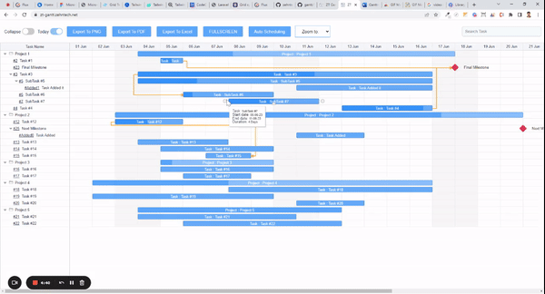

# Gantt Chart Library Documentation # 
  

### Introduction  ###
Welcome to the documentation for [ztGantt](https://zt-gantt.zehntech.net/) Chart Library. This library provides a powerful set of tools and functionalities to create interactive Gantt charts for project management. This documentation will guide you through the installation process, usage instructions, and available features of the library.   
  

### Table of Contents ###
1. [Installation](#installation)
2. [Getting Started](#getting-started) 
3. [Features](#features)   
  
  

### 1. Installation ###
To use the Gantt Chart Library, follow these steps:  
Download the library files from our website or repository. Include the library files (gantt.js and gantt.css) in your project. Add the necessary dependencies, such as jsPDF (V. 2.5.1) and html2canvas (V. 1.4.1) if you are using the export for the pdf or PNG. Link the library files in your HTML file.
You're now ready to start using the Gantt Chart Library!    

  
  

### 2. Getting Started 
To create a basic Gantt chart, follow these steps:   
Add files:   
~~~html

<link rel="stylesheet" href="gantt.css" type="text/css">
~~~  

Add markup:  
~~~html

~~~  

Initialize the Gantt Chart Library using JavaScript by targeting the container element.   

~~~js
let element = document.getElementById("gantt_here"); 
let gantt = new ztGantt(element);
gantt.options.columns = [ 
            {name: "text",width: 245, 
              min_width: 80, 
              max_width: 300, 
              tree: true, 
              label: "Name", 
              resize: true, 
              template: (task) => { 
                return `${ 
                  task.parent == 0 ? task.text : task.subject 
                }`; 
              }, 
            }, 
            {name: "estimated_hours",width: 100,min_width: 80, 
              tree: false, 
              align: "center", 
              label: "Planned Hour", 
              resize: true, 
              template: (task) => { 
                return `${task.estimated_hours || ""}`; 
              }, 
            }, 
          ]; 
  gantt.options.data = [ 
          {"id":1, "text":"Project 1", parent: 0, progress: 50}, 
          {"id":2, "text":"Task #1", "start_date":"05-05-2023", "end_date": "05-05-2023","parent":1, progress: 60}, 
          {"id":3, "text":"Task #2", "start_date":"05-05-2023", "end_date": "05-05-2023","parent":1, progress: 30}, 
          {"id":5, "text":"SubTask #1", "start_date":"05-05-2023", "end_date": "05-05-2023","parent":3, progress: 10}, 
          {"id":6, "text":"SubTask #2", "start_date":"05-05-2023", "end_date": "05-05-2023","parent":3, progress: 80}, 
          {id: 12, text: "Final Milestone", start_date: "06-17-2023", end_date: "06-17-2023", parent: 8, type:"milestone" }, 
          {"id":7, "text":"SubTask #3", "start_date":"05-05-2023", "end_date": "05-05-2023","parent":3, progress: 45}, 
          {"id":4, "text":"Task #3","parent":1, progress: 15}, 
          {"id":8, "text":"Project 2", "parent":0, progress: 55}, 
          {"id":9, "text":"Project 3", "parent":0, progress: 65}, 
          {"id":10, "text":"Project 4", "parent":0, progress: 75}, 
          {"id":11, "text":"Project 5", progress: 100}, 
          {id: 13, text: "Next Milestone", start_date: "06-17-2023", end_date: "06-17-2023", parent: 8, type:"milestone" }, 
      ] 
   gantt.options.scales= [ 
          { 
              unit: "week", 
              step: 1, 
              format: (t) => { 
              return "%d %F"; 
              }, 
          },
          { 
              unit: "day", step: 1, format: "%d %D" 
          }, 
      ]; 
gantt.options.links = [
        { "id":1, "source":1, "target":2, "type": 0},
        { "id":2, "source":2, "target":3, "type": 1},
        { "id":3, "source":3, "target":4, "type": 2},
        { "id":4, "source":12, "target":15, "type": 3}
    ]

gantt.render();
~~~ 
Define your tasks, their durations, and any dependencies. Render the chart by calling the appropriate function. gantt.render(element); Customize the chart's appearance and behavior as needed.   
  
[Live demo](https://zt-gantt.zehntech.net/)    
  
#### Complete Documentation ####  
  
[ztGantt Documentation](https://zt-gantt.zehntech.net/docx/Documentation.pdf)
    

### 3. Features ###  
  * 4 types of tasks linking: finish-to-start, start-to-start, finish-to-finish, start-to-finish    
    

  * dragging and dropping multiple tasks horizontally and vertically    
  * tasks filtering    
  * tooltips  
  * configurable columns in the grid  
  * customizable time scale and task edit form  
  * task progress percent and drag task progress    
  * export to PDF, PNG, and Excel    
  * zoom levels for viewing gantt with diffrent timeline like hour, day, week, month, qarter, and year  
  * view gantt in fullscreen    
  * expand/collapse all tasks  
  * add custom marker  
  * add/update/delete task  
      
  
  * open a single task  
  * Auto Scheduling tasks   
  * select start date and end date with drag and drop    
  
  You can see the full list of features in the [documentation](https://zt-gantt.zehntech.net/docx/Documentation.pdf) 